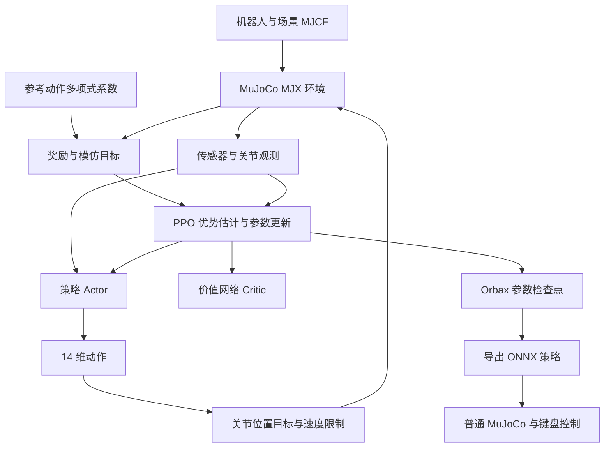

# Open Duck 训练流程学习笔记

本文以当前代码和 2026-10-07 的 WSL 复现为例，解释 Open Duck Mini V2 如何从物理仿真中学习站立、行走和转向。重点不是记住命令，而是建立“代码在做什么、为什么这样做、怎样验证结果”的对应关系。

文中的命令在 **WSL Ubuntu 的 Bash** 中运行，不是 Windows PowerShell。路径是本机配置，换机器时需要调整。本文不修改奖励、训练参数或机器人模型，也不会自动启动训练。

## 阅读路线

1. [先看整体流程](#1-我们究竟在训练什么)
2. [理解物理模型](#2-mujoco-如何表示机器人)
3. [理解强化学习问题](#3-把机器人控制写成强化学习问题)
4. [读懂环境的一次交互](#4-reset-和-step-完整展开)
5. [理解奖励和参考动作](#5-奖励决定学到的行为)
6. [理解 PPO 如何更新网络](#6-ppo-训练循环)
7. [理解扰动和随机化](#7-为什么训练环境比-viewer-复杂)
8. [实际运行训练](#8-从环境检查到正式训练)
9. [看日志和保存结果](#9-如何阅读-tensorboard-和训练产物)
10. [导出、推理和行为验证](#10-onnx-导出与-viewer-推理)
11. [续训和改进](#11-如何续训以及何时需要续训)
12. [排错和学习练习](#12-常见问题与排查顺序)

## 1. 我们究竟在训练什么

目标是训练一个策略网络：它读取传感器、关节状态和用户指令，输出关节动作，让机器人在物理仿真中完成任务。

网络不是直接输出“走到某个坐标”，也不是播放一段固定动画。它每个控制周期重新决定关节目标，形成闭环控制。



主要代码入口：

| 文件 | 负责什么 | 建议重点阅读的符号 |
|---|---|---|
| [机器人 runner](playground/open_duck_mini_v2/runner.py) | 解析参数，选择环境，启动训练 | `main`、`OpenDuckMiniV2Runner` |
| [公共 runner](playground/common/runner.py) | 配置 PPO、日志、评估和保存 | `BaseRunner.train`、`progress_callback`、`policy_params_fn` |
| [环境基类](playground/open_duck_mini_v2/base.py) | 加载模型，访问关节和传感器 | `OpenDuckMiniV2Env` |
| [行走环境](playground/open_duck_mini_v2/joystick.py) | 状态重置、观测、动作执行、奖励 | `Joystick.reset`、`step`、`_get_obs`、`_get_reward` |
| [站立环境](playground/open_duck_mini_v2/standing.py) | 另一套站立任务与奖励 | `Standing`、`default_config` |
| [公共奖励](playground/common/rewards.py) | 速度跟踪、力矩、动作变化等 | `reward_tracking_lin_vel`、`cost_stand_still` |
| [模仿奖励](playground/open_duck_mini_v2/custom_rewards.py) | 对照参考步态计算奖励 | `reward_imitation` |
| [动力学随机化](playground/common/randomize.py) | 改变质量、摩擦和执行器参数 | `domain_randomize` |
| [导出](playground/common/export_onnx.py) | 把策略权重转换为 ONNX | `export_onnx` |
| [推理](playground/open_duck_mini_v2/mujoco_infer.py) | 普通 MuJoCo 闭环控制 | `MjInfer.get_obs`、`key_callback`、`run` |

PPO 的主要实现来自安装的 **Brax**，环境包装来自 **MuJoCo Playground**；本仓库主要定义机器人任务，并不是从头实现 PPO。

## 2. MuJoCo 如何表示机器人

### 2.1 MJCF：物理模型而不是只有外观

MuJoCo 用 XML 格式的 MJCF 描述刚体系统。可以从 [带间隙机器人模型](playground/open_duck_mini_v2/xmls/open_duck_mini_v2_backlash.xml) 和 [平地场景](playground/open_duck_mini_v2/xmls/scene_flat_terrain_backlash.xml) 开始阅读。

| MJCF 元素 | 物理含义 |
|---|---|
| `body` | 刚体及父子关系 |
| `joint` / `freejoint` | 关节自由度；浮动基座可平移和旋转 |
| `inertial` | 质量、惯量和质心 |
| `geom` | 碰撞形状，也可用于显示 |
| `mesh` | 网格资源；看起来相同不代表碰撞配置相同 |
| `actuator` | 执行器，决定控制输入如何变成力或力矩 |
| `site` / `sensor` | 传感器的位置、坐标系和测量类型 |
| `keyframe` | 初始姿态，例如 `home` |
| `hfield` | 高度场，用于粗糙地形 |

机器人“站得住”与质量、质心、摩擦、关节参数、接触和策略都有关系；不能只观察网格外观判断控制质量。

### 2.2 `Model` 与 `Data`

- `mujoco.MjModel` 描述机器人结构和仿真参数，例如关节地址、质量和时间步。
- `mujoco.MjData` 保存当前时刻的动态状态，例如位置、速度、接触和传感器读数。
- `mujoco.mj_step(model, data)` 根据当前控制输入推进物理仿真。
- `mjx.put_model` 把模型转换为 MJX 表示，便于 JAX 编译和批量计算。

几个容易混淆的数组：

| 数组 | 含义 | 注意 |
|---|---|---|
| `qpos` | 广义位置 | 浮动基座旋转用四元数，不是三个欧拉角 |
| `qvel` | 广义速度 | 浮动基座含三维线速度和三维角速度 |
| `ctrl` | 执行器输入 | 本项目把它设为关节位置目标，不是直接写力矩 |
| `actuator_force` | 执行器实际产生的广义力 | 用于力矩代价 |
| `sensordata` | 各传感器的输出 | 必须按传感器地址读取，而不是把 ID 当地址 |

因此，`qpos` 与 `qvel` 的维度不一定相同；关节 ID、`qpos` 地址和 `qvel` 地址也不能混用。[环境基类](playground/open_duck_mini_v2/base.py) 中的访问函数就是为了处理这些区别。

### 2.3 Backlash：关节间隙

`flat_terrain_backlash` 使用带机械间隙的模型。它在实际执行器关节之外还有模拟间隙的关节，但策略仍只控制实际的 **14 个执行器**：左腿 5 个、颈部和头部 4 个、右腿 5 个。

这些附加关节不是额外的策略动作。读取关节状态时必须区分实际关节和间隙关节，不能简单地把全部 `qpos[7:]` 当作策略控制的关节角。

### 2.4 MJX、JAX 与 GPU

普通 MuJoCo 适合交互式仿真；MJX 让物理计算进入 JAX 的计算图，适合在 GPU 上批量模拟许多环境。

- `jax.jit` 编译计算，因此首次启动可能较慢。
- `jax.vmap` 对独立样本批量计算，随机化中也使用了它。
- 每个环境有自己的状态和随机数，不能把 2048 个环境理解为一台机器人的 2048 个线程。
- JAX 数组通常不可原地修改：`values.at[index].set(new_value)` 返回新数组，需要接住返回值。

最后一点曾造成实际问题：训练端没有接住加速度计偏置修改，而旧 viewer 却真正加上了偏置。代码看起来相似，网络实际收到的观测却不同。

## 3. 把机器人控制写成强化学习问题

### 3.1 状态、观测、动作和奖励

强化学习通常描述为：

$$
s_{t+1}\sim P(\cdot\mid s_t,a_t),\qquad
a_t\sim\pi_\theta(\cdot\mid o_t),\qquad
r_t=R(s_t,a_t,s_{t+1}).
$$

这里的真实物理状态 $s_t$ 包括基座、关节、接触等；策略看到的 $o_t$ 是从传感器与历史中构造的有限观测，二者不是同一个对象。

策略参数 $\theta$ 是需要学习的网络权重。MuJoCo 决定动作后的物理变化，奖励函数决定什么行为值得鼓励。

本项目的任务指令为 7 维：

```text
[前后速度, 横向速度, 偏航角速度,
 颈部俯仰, 头部俯仰, 头部偏航, 头部侧倾]
```

默认训练范围见 [Joystick 配置](playground/open_duck_mini_v2/joystick.py)：前后速度 `[-0.15, 0.15] m/s`，横向速度 `[-0.2, 0.2] m/s`，转向速度 `[-1, 1] rad/s`。`sample_command` 随机采样这些指令，并有 10% 概率把全部指令设为零。

### 3.2 Actor 和 Critic 看到的东西不同

`_get_obs` 返回两个键：

```python
{"state": state, "privileged_state": privileged_state}
```

当前已验证配置中，Actor 使用 `state`，Critic 使用 `privileged_state`。这种设计称为非对称 Actor-Critic：训练时让价值网络看到更完整的仿真信息，但部署时策略不依赖这些特权信息。

当前 14 执行器行走模型的策略观测为 **101 维**：

| 内容 | 维数 | 用途 |
|---|---:|---|
| 陀螺仪 | 3 | 身体旋转速度 |
| 加速度计 | 3 | 身体加速度和重力相关测量 |
| 任务指令 | 7 | 想往哪里走、怎样控制头部 |
| 关节角相对默认姿态的误差 | 14 | 当前关节姿态 |
| 关节速度，乘 `0.05` | 14 | 当前关节运动 |
| 最近三次策略动作 | 42 | 动作历史，辅助理解延迟和运动趋势 |
| 当前电机目标 | 14 | 执行器正在跟踪什么 |
| 双脚接触 | 2 | 支撑状态 |
| 步态相位的余弦和正弦 | 2 | 周期步态位置 |
| 合计 | 101 | ONNX 策略输入 |

不要根据代码里“10 个关节”“3 维 command”等旧注释推算维度，要以实际数组和运行时形状为准。

`privileged_state` 还包含较完整的速度、姿态、执行器力、脚部状态和参考动作等；本次行走配置实测为 **212 维**。换模型、参考数据或关闭模仿时，不应假定这个维度固定不变。

## 4. `reset` 和 `step` 完整展开

### 4.1 `reset`：开始一个 episode

[Joystick.reset](playground/open_duck_mini_v2/joystick.py) 主要执行：

1. 从 MJCF 的 `home` 关键帧取得初始姿态。
2. 随机扰动基座平面位置、偏航、实际关节角和基座速度。
3. 创建 MJX 动态数据；兼容旧 `mjx_env.init` 和新 `make_data`。
4. 采样 7 维任务指令和外力扰动间隔。
5. 若启用模仿，计算初始参考动作。
6. 清空动作历史、IMU 历史、接触记录和步态计数器。
7. 构建第一次观测，返回 `mjx_env.State`。

`State` 不仅有物理 `data`，还有 `obs`、`reward`、`done`、`metrics` 和 `info`。`info` 保存随机数、历史和计数器，是环境继续演化所需的状态，不等于全部交给 Actor 的输入。

### 4.2 时间尺度：500 Hz 物理、50 Hz 控制

默认配置：

```python
ctrl_dt = 0.02
sim_dt = 0.002
episode_length = 1000
```

物理仿真每 2 ms 一步，控制策略每 20 ms 出一次动作，即一次控制更新对应 **10 次物理步进**。1000 个控制步对应约 20 秒仿真时间，但 episode 可能提前终止。

这些都不是墙钟时间。3 亿训练步也不是让一台机器人在电脑上实时走完 3 亿次：许多环境并行收集控制步，实际采样速度取决于 GPU、模型、并行数和 PPO 配置。

### 4.3 网络动作如何变成关节运动

Actor 输出 14 维动作。关节目标的关键代码是：

```python
motor_targets = default_actuator + action * action_scale
```

默认 `action_scale=0.25`，即动作表示相对于默认关节目标的偏移。策略不是直接设置基座速度；它通过关节运动间接产生速度。

执行器可理解为根据位置误差和速度反馈产生力矩的伺服控制，示意为：

$$
\tau\approx k_p(q_{\mathrm{target}}-q)-k_d\dot q.
$$

实际行为还取决于 MJCF 中的执行器、阻尼、摩擦和力矩限制。上式只是帮助理解，不是替代 MuJoCo 的完整动力学。

目标还被限制为每周期最多变化：

$$
\Delta q_{\mathrm{target,max}}=5.24\times0.02=0.1048\ \mathrm{rad}.
$$

这是对相邻目标变化的限制，不保证真实关节速度始终等于或小于该值。不要为“提速”随意改动作缩放、控制周期或这一限制，它们都是训练条件的一部分。

### 4.4 `step` 的具体顺序

`Joystick.step` 的主要工作：

1. 推进步态相位，按速度指令查询当前参考动作。
2. 更新动作历史，随机选择延迟后的动作。
3. 到指定间隔时，对基座速度施加扰动。
4. 把动作转换为电机位置目标，并限制相邻目标变化。
5. 调用 `mjx_env.step(..., n_substeps)` 推进物理。
6. 检查双脚接触，更新脚部腾空时间等记录。
7. 计算新观测、终止标志和各奖励项。
8. 记录历史、更新计数器；超过 500 个控制步后重新采样指令。
9. 返回新的 `State`，由训练包装器负责 episode 管理。

注意，当前实现构建新观测时，动作历史尚未在函数末尾更新。复现时应尊重实际顺序，不要只把概念流程图当成可直接替换源码的实现。

### 4.5 跌倒终止与时间截断不是同一回事

行走环境的 `_get_termination` 检查身体上方向的 Z 分量是否小于零，以及 `qpos` / `qvel` 是否含 NaN。episode 达到长度上限则由包装器处理。

这并不是“倾斜超过几度就失败”。机器人侧倾但仍未翻倒时，可能继续得到奖励。训练终止规则、超时截断和行为验收阈值应分别理解。

## 5. 奖励决定学到的行为

### 5.1 每项奖励与代码对应

[Joystick._get_reward](playground/open_duck_mini_v2/joystick.py) 调用公共和自定义奖励函数，然后乘配置中的权重：

| 项目 | 默认权重 | 含义 |
|---|---:|---|
| `tracking_lin_vel` | `2.5` | 跟踪前后与横向速度 |
| `tracking_ang_vel` | `6.0` | 跟踪偏航角速度 |
| `torques` | `-0.001` | 减少执行器力的平方和 |
| `action_rate` | `-0.5` | 减少相邻动作差异 |
| `stand_still` | `-0.2` | 零速度附近约束默认姿态和关节速度 |
| `alive` | `20.0` | 常数存活收益；episode 提前结束会失去后续收益 |
| `imitation` | `1.0` | 根据参考动作约束步态 |

最终每个控制步的奖励为：

$$
r_t=\operatorname{clip}\left(\Delta t\sum_k w_k f_k,\ 0,\ 10000\right),\qquad\Delta t=0.02.
$$

负权重对应代价，但总奖励在当前代码中被截断为非负值。只改一个权重可能与其他项目和截断发生交互，不能把权重大小直接当作该项对训练的实际贡献。

速度跟踪用指数形式，误差越小奖励越高。横向速度特别设置了 `0.1 m/s` 的容差，因此它不是简单的二维速度平方误差。精确公式见 [公共奖励](playground/common/rewards.py)。

### 5.2 参考动作不是预训练策略

[参考动作模块](playground/common/poly_reference_motion.py) 加载 `polynomial_coefficients.pkl`，按前后、横向和转向指令选择系数，再按周期相位求多项式值。

当前实现对速度范围进行裁剪，然后选择最接近的离散速度索引，**不是对速度网格做连续插值**。参考动作包含关节状态、脚接触和速度等目标，用于奖励以及 Critic 的特权信息。

它不是 Actor 的权重，也不是把参考关节角直接赋给电机。策略动作仍由 PPO 学习。

默认 `USE_IMITATION_REWARD=True`，所以行走环境初始化依赖该文件。关闭这个开关才会跳过加载；仅把模仿权重设为零并不能去掉初始化依赖。Pickle 只应加载可信来源的文件。

### 5.3 为什么奖励上升但机器人可能仍然歪

当前零速度指令下，模仿奖励被关闭；行走奖励列表也未启用直接的躯干姿态代价。静止姿态代价存在，但权重相对有限。

策略可能找到“稳定、不倒、力矩较小，但身体和头部有倾斜”的解。本机当前策略在全零指令下的测量显示，稳定阶段身体横滚约 `-7.2°`、俯仰约 `2.9°`，头部侧倾关节约 `-12°`。这不代表 MuJoCo 初始姿态就是歪的：初始基座横滚和俯仰均为零。

同样，“角速度接近零”只能说明不在继续旋转，不能说明身体已经竖直。

优化站姿应考虑静止时的躯干姿态、默认姿态或头部指令跟踪约束，再做受控续训。[Standing 环境](playground/open_duck_mini_v2/standing.py) 已使用姿态和头部相关奖励，可以作为阅读参考，但它是另一套任务，不应直接拿现有行走 ONNX 加 `--standing` 就认为变成了站立策略。

## 6. PPO 训练循环

### 6.1 策略不是每走一步立即更新一次

一次 PPO 更新大致包括：

1. 用当前随机策略在许多环境中收集 rollout。
2. 保存观测、动作、奖励、旧动作概率和价值估计。
3. 根据回报和 Critic 计算优势，表示某次动作比预期好多少。
4. 把数据拆成 minibatch，多次更新策略和价值网络。
5. 用更新后的策略继续收集新数据。

PPO 是 on-policy 方法：更新主要使用当前附近策略刚收集的数据，而不是无限复用很久以前的任意经验。

### 6.2 回报、价值与优势

策略希望提高折扣累计回报：

$$
J(\theta)=\mathbb E\left[\sum_{t=0}^{T-1}\gamma^t r_t\right].
$$

Critic 估计 $V_\phi$，帮助判断动作收益。常用的 TD 残差和 GAE 示意为：

$$
\delta_t=r_t+\gamma V_\phi(s_{t+1})-V_\phi(s_t),\qquad
\hat A_t=\sum_{l\ge0}(\gamma\lambda)^l\delta_{t+l}.
$$

实际计算还要处理 episode 结束和超时截断；不能机械地把跨 episode 的数据接起来。这里的 $s$ 可以理解为 Critic 使用的特权观测。

### 6.3 PPO 为什么要 clip

设新旧策略对采样动作的概率比为 $\rho_t$，PPO 的核心目标是：

$$
L^{\mathrm{clip}}=\mathbb E\left[\min\left(\rho_t\hat A_t,\operatorname{clip}(\rho_t,1-\epsilon,1+\epsilon)\hat A_t\right)\right].
$$

它限制单次更新改变策略的激进程度。完整训练还有价值损失、熵项和梯度限制。熵鼓励探索，但探索本身不保证稳定站立。

### 6.4 本项目从哪里取得参数

`BaseRunner.train` 调用：

```python
locomotion_params.brax_ppo_config("BerkeleyHumanoidJoystickFlatTerrain")
```

所以配置来自安装的 MuJoCo Playground 版本，并非本仓库独立定义的 Open Duck PPO 配置。命令行只覆盖部分参数；升级依赖可能改变其余默认值，应保存实际打印的 `PPO params` 和依赖版本。

本次已验证环境中：Actor 和 Critic 隐藏层为 `[512, 256, 128]`，学习率 `0.0003`，折扣 `0.97`，clip 系数 `0.2`，熵系数 `0.005`，`unroll_length=20`，`num_updates_per_batch=4`，并启用观测归一化。这些不是对任意未来版本的保证。

| 可覆盖参数 | 作用 | 不应怎样理解 |
|---|---|---|
| `num_timesteps` | 环境控制步采样预算 | 不是优化器更新次数 |
| `num_envs` | 并行环境数量 | 增大并不必然按比例提速 |
| `batch_size` | Brax 的训练批次参数 | 不等于并行环境数 |
| `num_minibatches` | minibatch 数量 | 与批次、rollout 共同决定采样及更新规模 |
| `num_evals` | 评估次数配置 | 评估也消耗时间 |
| `num_eval_envs` | 并行评估环境数 | 不等于训练环境数 |
| `num_resets_per_eval` | 每次评估的重置配置 | 不直接增加策略学习数据 |
| `seed` | 随机种子 | 不保证跨依赖和硬件完全复现 |

在该版 Brax 中，`batch_size * num_minibatches` 为更新数据中的 rollout 轨迹数量级，每条轨迹长 `unroll_length`；并行环境数较小时需要多轮采样凑齐数据。具体整除和设备约束以安装版 Brax 的检查为准，不要只改 `num_envs` 而忽略其余配置。

## 7. 为什么训练环境比 viewer 复杂

训练包含三类不同的不确定性：

| 类型 | 实现位置 | 目的 |
|---|---|---|
| 初始状态随机化 | `Joystick.reset` | 不只会从一张完美站姿开始 |
| 观测噪声、动作延迟和外力扰动 | `Joystick._get_obs`、`step` | 对不准确测量、延迟和扰动更稳健 |
| 动力学随机化 | [domain_randomize](playground/common/randomize.py) | 减少依赖某一套精确物理参数 |

动力学随机化覆盖地面摩擦、关节摩擦、armature、质心、各刚体质量、关节初始位置偏差和执行器增益等。它不会自动证明策略能迁移到实机。

默认动作延迟索引采样上界是排他的，所以配置 `action_max_delay=3` 对应当前采样代码的索引 `0、1、2`，不要仅凭变量名理解为一定包含 3 步延迟。

代码虽然计算了重力方向噪声和 IMU 历史，但当前 Actor 的观测拼接并未包含那一项；实际包含陀螺仪和加速度计。配置中存在某个噪声项，不等于它一定影响当前策略输入。

训练时的噪声或随机化是有意设计的不确定性；推理时错误地改单位、顺序、偏置或历史则是输入契约错误，两者不能混为一谈。

## 8. 从环境检查到正式训练

### 8.0 训练命令背后的调用链

```text
python -m playground.open_duck_mini_v2.runner
  -> main：解析命令行参数
  -> OpenDuckMiniV2Runner：按 --env 选择模块，创建训练与评估环境
  -> BaseRunner.train：取得 PPO 配置，应用覆盖参数，建立网络工厂
  -> brax.training.agents.ppo.train：包装环境、采样、优化和评估
  -> Joystick.reset / step：执行机器人任务
  -> progress_callback / policy_params_fn：记录指标、保存参数和导出
```

本地 runner 的 `--env` 默认是 `joystick`，`--task` 默认是普通 `flat_terrain`，训练预算默认为 1.5 亿步。本文正式示例显式选择带间隙模型和 3 亿步，与默认命令并不相同。

若选择 `--env standing`，训练与评估环境都会换成站立任务。这是训练目标的改变，不是 viewer 的 `--standing` 输入模式开关；两者不能混用。

### 8.1 先确认解释器、源码与 GPU

下面设置 Bash 变量，后续同一个终端继续使用：

```bash
export ROOT=/mnt/e/cccodes/robot/Open_Duck_Playground
export PY=/home/chench53/cccodes/Open_Duck_Playground_Resources/.venv/bin/python
export PYTHONPATH="$ROOT"
cd "$ROOT"
nvidia-smi
"$PY" -c 'import sys, playground, jax, mujoco; print(sys.executable); print(playground.__file__); print(jax.devices()); print(mujoco.__version__)'
test -f playground/open_duck_mini_v2/data/polynomial_coefficients.pkl
"$PY" -m playground.open_duck_mini_v2.runner --help
```

期望源码位于 `$ROOT`，JAX 能看到 CUDA 设备。`nvidia-smi` 成功只证明 GPU 驱动可见，不证明当前 Python 安装了可用的 JAX CUDA 插件。

本机已验证 Python 3.12.15、MuJoCo/MJX 3.14.0、JAX/JAXlib 0.6.2 和 CUDA12 插件、Playground 0.2.0、Brax 0.14.2。`pyproject.toml` 使用较宽的版本范围，重新安装可能得到不同版本。

在已有可用虚拟环境上学习时，不要为了运行示例盲目升级整套依赖。新环境可按 [README](README.md) 安装，之后再次检查导入、设备和版本。

### 8.2 先做短训练，而不是直接跑 3 亿步

短训练用于发现加载、GPU、日志、保存和导出问题，不用于判断已经学会行走。使用独立的新目录：

```bash
export RUN="$ROOT/checkpoints/learning_smoke_$(date +%Y%m%d_%H%M%S)"
mkdir -p "$RUN"
set -o pipefail
env XLA_PYTHON_CLIENT_MEM_FRACTION=0.75 \
  TF_NUM_INTRAOP_THREADS=4 TF_NUM_INTEROP_THREADS=2 OMP_NUM_THREADS=4 \
  MUJOCO_GL=egl "$PY" -u -m playground.open_duck_mini_v2.runner \
  --env joystick --task flat_terrain_backlash --num_timesteps 10240 \
  --num_envs 128 --batch_size 64 --num_minibatches 2 \
  --num_evals 2 --num_eval_envs 16 --num_resets_per_eval 0 --seed 0 \
  --output_dir "$RUN" 2>&1 | tee "$RUN/stdout.log"
```

`-u` 及时输出日志；`tee` 同时写终端和文件；`pipefail` 避免把训练失败误判成 `tee` 成功。首次 JIT 编译可能占据短训练的大部分耗时，不能直接用它估算长期吞吐。

确认进程正常退出、目录包含事件文件、Orbax 参数目录和 ONNX。步数 0 的导出可能只是初始化策略，不应误当训练好的模型。

### 8.3 正式训练示例

以下参数在本机 RTX 5070 Ti 16 GB 和约 15 GiB WSL 内存上完成过训练，并不是所有机器的最优配置：

```bash
export RUN="$ROOT/checkpoints/learning_full_$(date +%Y%m%d_%H%M%S)"
mkdir -p "$RUN"
set -o pipefail
env XLA_PYTHON_CLIENT_MEM_FRACTION=0.75 \
  TF_NUM_INTRAOP_THREADS=4 TF_NUM_INTEROP_THREADS=2 OMP_NUM_THREADS=4 \
  MUJOCO_GL=egl "$PY" -u -m playground.open_duck_mini_v2.runner \
  --env joystick --task flat_terrain_backlash --num_timesteps 300000000 \
  --num_envs 2048 --batch_size 256 --num_minibatches 32 \
  --num_evals 16 --num_eval_envs 128 --num_resets_per_eval 1 --seed 0 \
  --output_dir "$RUN" 2>&1 | tee "$RUN/stdout.log"
```

不要同时启动多份长训练，也不要在另一份源码 checkout 中训练。保留进程直到结束，避免关闭训练终端或 WSL。

GPU 预分配显存不等于每个字节都在有效计算。查看 `nvidia-smi`、WSL 内存和日志，区分预分配、运行时显存不足、CPU 编译和真正的吞吐问题。

可额外记录环境版本，帮助复现实验：

```bash
"$PY" -m pip freeze > "$RUN/packages.txt"
```

如果虚拟环境由 uv 管理且未安装 pip，改用：

```bash
uv pip freeze --python "$PY" > "$RUN/packages.txt"
```

### 8.4 可用任务不是资源存在的保证

[constants.py](playground/open_duck_mini_v2/constants.py) 注册了平地、粗糙地形及它们的 backlash 版本，但当前源码未提供普通 `scene_rough_terrain.xml`。应先使用已验证的 `flat_terrain_backlash`；换任务前检查 XML 和所有资源。

高度场也受到 MJCF 编译器资源目录影响。本项目带间隙模型设置 `meshdir="assets"`，粗糙场景的高度场文件因此写成 `hfield.png`，不能再重复为 `assets/hfield.png`。

## 9. 如何阅读 TensorBoard 和训练产物

### 9.1 日志从哪里来

`BaseRunner` 用 `tensorboardX.SummaryWriter` 写入 `--output_dir`。`progress_callback` 接收 Brax 的训练和评估指标，写 scalar 并刷新。

训练回调并不总包含 `eval/episode_reward`；当前代码只在收到该键时打印评估奖励，其他训练指标仍写入 TensorBoard。终端长时间没有评估行，不一定表示训练停止。

在另一个 WSL 终端启动 TensorBoard，必要时先安装：

```bash
uv pip install --python /home/chench53/cccodes/Open_Duck_Playground_Resources/.venv/bin/python tensorboard
env CUDA_VISIBLE_DEVICES=-1 \
  /home/chench53/cccodes/Open_Duck_Playground_Resources/.venv/bin/tensorboard \
  --logdir /mnt/e/cccodes/robot/Open_Duck_Playground/checkpoints \
  --host 0.0.0.0 --port 6006
```

打开 `http://localhost:6006/`；如果端口已被现有 TensorBoard 使用，复用它或换端口，不要盲目结束其他任务。

### 9.2 应看哪些指标

| 指标 | 如何理解 |
|---|---|
| `eval/episode_reward` | 评估回报的均值；不是速度或“站直程度” |
| `eval/episode_reward_std` | 不同 episode 的表现差异 |
| 含 `reward/`、`cost/` 的分项 | 环境记录的加权奖励或代价，经过包装器汇总后的完整标签依赖版本 |
| 含 `policy_loss`、`v_loss`、`entropy_loss` 的项目 | 优化行为；不是越低越能走 |
| 含 `sps` 的项目 | 采样或评估吞吐，不是机器人的速度 |

应同时看均值、方差、奖励分项和实际行为。后期回报波动不意味着文件损坏，最后一个检查点也不必然是最佳策略。

PPO 按采样批次和评估周期组织工作，实际最终步数可能略超预算；本次 3 亿步配置实际完成 `302,284,800` 步。比较实验时保存实际步数，而不只记录命令行预算。

### 9.3 三类文件不要混用

| 文件或目录 | 内容 | 可以用来做什么 |
|---|---|---|
| `polynomial_coefficients.pkl` | 参考动作系数 | 构建模仿目标，不能直接当策略执行 |
| 时间戳与步数命名的 Orbax 目录 | 策略、价值及归一化相关参数 | 参数恢复或暖启动 |
| 同名 `.onnx` | 可执行的确定性 Actor | ONNX Runtime 推理，不是完整训练状态 |
| `events.out.tfevents...` | 训练指标 | TensorBoard 查看 |
| `stdout.log` | 控制台输出 | 查配置、异常和保存过程 |

`policy_params_fn` 保存传入的 `params`，然后导出 ONNX。当前导出还会额外写工作目录中的 `ONNX.onnx`，因此有明确时间戳和步数的文件更便于追溯。

这些训练产物和 `.tmp` 缓存被 Git 忽略；克隆代码仓库不会自动获得本机已训练策略。

## 10. ONNX 导出与 viewer 推理

### 10.1 网络部署时还需要观测归一化

[export_onnx](playground/common/export_onnx.py) 的步骤是：

1. 取出策略观测的均值和标准差。
2. 构造与 Actor 对应的 TensorFlow MLP。
3. 把 JAX/Flax 策略权重复制到对应层。
4. 在输入上执行 `(obs - mean) / std`。
5. 取策略输出的 `loc` 分支，执行 `tanh`，得到确定性动作。
6. 用 `tf2onnx` 导出固定输入形状 `(1, obs_size)` 的模型。

训练策略有用于探索的分布参数；当前导出不进行随机采样，也不导出 Critic。不能简单把一次带探索噪声的训练 rollout 与确定性 ONNX rollout 当成完全相同的实验。

当前行走模型输入名称为 `obs`，形状 `(1, 101)`，输出为 14 维动作。导出代码禁用了 TensorFlow GPU，GPU 留给 JAX 训练。

### 10.2 普通 MuJoCo 中重复控制闭环

[MjInfer.run](playground/open_duck_mini_v2/mujoco_infer.py) 不再更新网络权重，而是反复执行：

```text
物理步进 -> 每 10 步构造观测 -> ONNX Runtime 推理
         -> 更新动作历史 -> 关节目标与变化率限制 -> 写入 data.ctrl
```

这里使用 NumPy 和普通 MuJoCo，而训练使用 JAX/MJX。两边的输入顺序、单位、偏置、关节映射、接触含义、历史和相位必须一致或具有明确解释。

模型能加载、能输出动作，只能证明接口基本可用，不能证明观测契约正确。旧加速度计偏置就是反例：模型没有报错，但前进受到严重抑制。同一权重移除该偏置后，15 秒前进距离从约 `0.056 m` 提升到 `1.091 m`。

### 10.3 启动 viewer

下面复用第 8 节的 `$ROOT` 和 `$PY`，将 `ONNX` 替换为自己导出的文件：

```bash
cd "$ROOT"
export ONNX="$ROOT/checkpoints/reproduce_20261007/2026_10_07_113243_302284800.onnx"
env PYTHONPATH="$ROOT" MUJOCO_GL=glfw "$PY" -u \
  -m playground.open_duck_mini_v2.mujoco_infer \
  --onnx_model_path "$ONNX" \
  --model_path playground/open_duck_mini_v2/xmls/scene_flat_terrain_backlash.xml \
  --reference_data playground/open_duck_mini_v2/data/polynomial_coefficients.pkl
```

该示例权重仅存在于本机训练目录，不随 Git 提供。WSLg 负责显示窗口；`MUJOCO_GL=egl` 通常用于无窗口渲染，不能把它与交互窗口的 `glfw` 混为一谈。

项目自定义键盘输入：

| 按键 | 默认行走模式中的含义 |
|---|---|
| 方向上 / 下 | 前进 / 后退，目标速度为正负 `0.15 m/s` |
| 方向左 / 右 | 左右横移，目标速度为正负 `0.2 m/s` |
| `Q` / `E` | 正负 `1 rad/s` 转向 |
| `H` | 切换头部与行走输入，日志显示模式 |
| `P` / `;` | 步态相位速度系数增加 / 减少 `0.1` |

默认是行走模式，点击窗口后可以直接按方向上。每次键盘回调会替换其他速度分量；松键不自动停止，不能靠同时按上和 Q 得到前进加转向。`P` 也会清零速度，需要再次按方向上。

进入头部模式后，方向键控制头部俯仰和偏航，Q/E 控制侧倾。头部指令在切回行走模式后可能保留，因此“速度为零”不一定代表全部 7 维指令为零。测试默认站姿时最好使用新启动的 viewer。

### 10.4 行为验收比单看奖励更重要

建议对每个策略分别测试：

1. 全部指令为零，站立至少 15 秒，记录横滚、俯仰和位置漂移。
2. 前进 `0.1` 或 `0.15 m/s`，持续超过 10 秒，记录位移、平均速度、偏航和跌倒。
3. 联合前进与转向，检查边走边转；当前键盘不支持组合轴，需要程序设置完整命令。
4. 后退、横移、不同初始姿态及扰动。
5. 在与训练一致的模型上验收后，再比较普通平地模型等其他条件。

本机六个确定性 15 秒站立、前进、转向案例通过，键盘前进也达到约 `1.61 m / 12 s`，但身体倾斜、头部姿态偏差和前进偏航仍存在。**通过“不倒和有位移”的检查，不等于通过“站直、精确直行、长期鲁棒”的检查。**

## 11. 如何续训以及何时需要续训

### 11.1 使用 Orbax 目录暖启动

`--restore_checkpoint_path` 应指向时间戳与步数目录，而不是同名 ONNX。先设置新输出目录，避免覆盖原实验：

```bash
export CKPT="$ROOT/checkpoints/reproduce_20261007/2026_10_07_113243_302284800"
export RUN="$ROOT/checkpoints/learning_finetune_$(date +%Y%m%d_%H%M%S)"
mkdir -p "$RUN"
set -o pipefail
env XLA_PYTHON_CLIENT_MEM_FRACTION=0.75 \
  TF_NUM_INTRAOP_THREADS=4 TF_NUM_INTEROP_THREADS=2 OMP_NUM_THREADS=4 \
  MUJOCO_GL=egl "$PY" -u -m playground.open_duck_mini_v2.runner \
  --env joystick --task flat_terrain_backlash --num_timesteps 50000000 \
  --num_envs 2048 --batch_size 256 --num_minibatches 32 \
  --num_evals 6 --num_eval_envs 128 --num_resets_per_eval 1 --seed 0 \
  --restore_checkpoint_path "$CKPT" --output_dir "$RUN" \
  2>&1 | tee "$RUN/stdout.log"
```

这是暖启动示例，**不是经过验证的站姿优化方案**。如果不改训练目标，追加步数不保证解决侧倾。

本仓库的保存回调写的是网络和归一化相关参数，而非完整 PPO 训练状态。因此不要承诺恢复了全部优化器状态、随机数和累计步数；具体恢复行为取决于安装版 Brax。应把它理解为参数暖启动，并核对恢复日志。

### 11.2 哪些问题不需要重训

键盘模式错误、加载错模型、输入顺序或单位错误、viewer 独有的传感器偏置，应先修复推理或配置。用同一权重做 A/B 测试是区分策略问题与部署问题的有效方法。

### 11.3 哪些目标通常需要改训练并再验证

更直的静止姿态、更精确的头部跟踪、更高的速度范围或新的地形鲁棒性，通常需要调整目标或数据，再进行续训。

实验时只改变一个主要因素，保留原权重与日志。增加静止姿态约束时，应考虑只在相应指令条件下生效，避免压制行走需要的身体摆动或主动头部动作。扩大速度范围时，同时核对参考数据范围，避免参考查询裁剪后变成不匹配目标。

观测维度、执行器数量或网络结构发生变化时，原检查点不一定能兼容；不能把所有改动都视为直接续训。

## 12. 常见问题与排查顺序

| 现象 | 先查什么 |
|---|---|
| 找不到模块 | 解释器、`PYTHONPATH`、`playground.__file__` 和依赖版本 |
| JAX 只有 CPU | CUDA 插件、WSL GPU 访问，不能只看驱动版本 |
| 缺 `collision` 或 `mjx_env.init` | 当前仓库已提供兼容适配，检查是否导入了旧 checkout |
| 找不到参考数据 | 当前工作目录、默认模仿开关和文件路径 |
| 粗糙地形资源路径重复 | `meshdir` 与 `hfield file` 的组合 |
| 首次启动很慢 | JIT 编译、CPU 内存和缓存，不要立刻重复启动训练 |
| 保存成功但导出失败 | TensorFlow / tf2onnx 兼容性、实际网络结构和参数树 |
| 奖励增加却不行走 | 加载的模型、指令、观测契约、归一化和奖励分项 |
| 方向键只动头 | `Control mode`，是否误切到头部模式 |
| 站着歪但不倒 | 真实姿态、残留头部指令、静止奖励目标，而不是直接强改关节角 |
| 看起来走得慢 | 实际速度范围、仿真时间与墙钟时间，区分播放速度和步行速度 |
| 日志中有旧失败记录 | 看当前运行、时间戳和最终退出状态，不要只搜索任意 `Error` |

推荐排查顺序：**运行环境 → 模型资源 → 输入契约 → 动作执行 → 物理行为 → 奖励与训练目标**。只有证据指向策略学习问题时，再考虑续训。

## 13. 建议的学习练习

1. 在不启动长训练的情况下，阅读 `reset`、`_get_obs` 和 `step`，手算 101 维观测的组成。
2. 区分 `qpos`、关节角、动作和 `motor_targets`；举例计算某个动作对应的位置偏移与目标变化限制。
3. 查看参考动作查询，解释为什么扩大速度指令不能自动生成新的高速参考步态。
4. 同时看 TensorBoard 的总奖励、分项和 viewer；找出“站得住”和“站得直”为什么不是同一目标。
5. 对同一 ONNX 做全零、前进、横移和转向测试，记录指令速度、实测速度、横滚、俯仰和偏航。
6. 学习暖启动前，先保存基线报告，再设计只改变一项奖励的实验；没有明确假设时不要盲目增加训练步数。

外部参考：[MuJoCo 文档](https://mujoco.readthedocs.io/)、[MJX](https://mujoco.readthedocs.io/en/stable/mjx.html)、[JAX 文档](https://docs.jax.dev/en/latest/)、[Brax](https://github.com/google/brax)、[MuJoCo Playground](https://github.com/google-deepmind/mujoco_playground)。外部 API 随版本变化，本文的具体流程以当前源码和记录的运行版本为准。